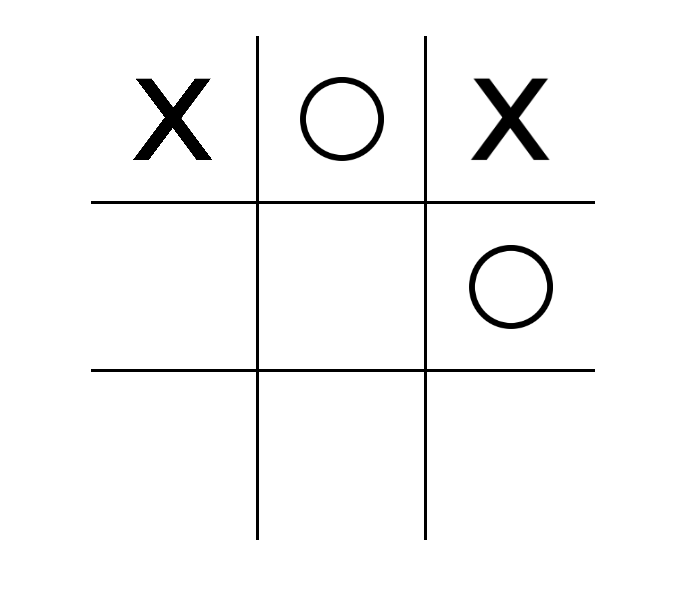
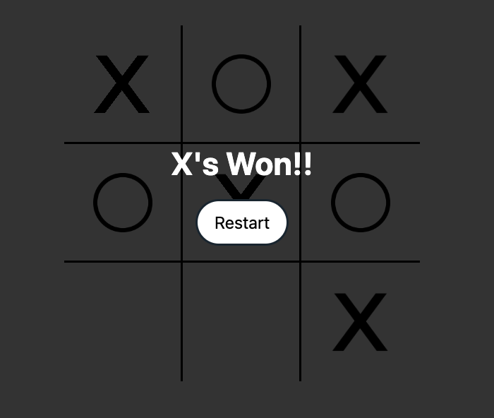
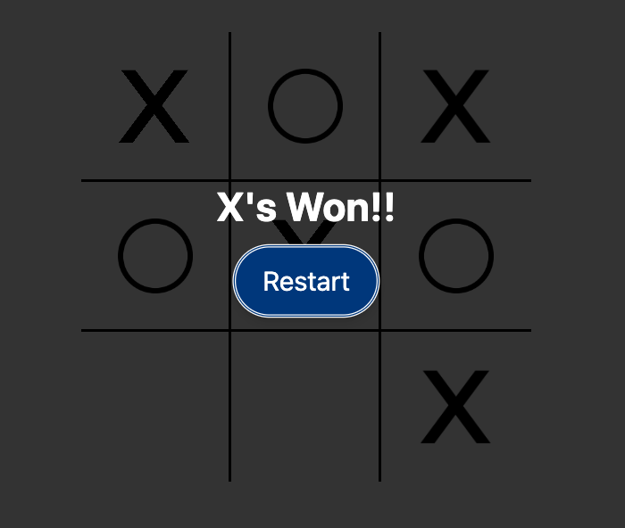

# Tic-Tac-Toe Game



## Description

This is a simple web-based Tic-Tac-Toe game built using HTML, CSS, and JavaScript, with styling enhanced using Tailwind CSS. The player takes turns marking cells on a 3x3 grid with their symbol (X) and symbol (O). If a horizontal, vertical, or diagonal line of their symbols is formed a winning message is shown. For no winning combinations the game ends in a draw.

## Features

- Interactive grid: Click on empty cells to mark them with symbols.
- Winning detection: The game automatically detects a winning combination or a draw.
- Restart button: Restart the game to play again after a win or draw.

## How to Play

1. Open the `index.html` file in a web browser.
2. Click on an empty cell to mark it with the game symbols. 
4. The game will detect a winning combination or a draw.
5. Click the "Restart" button to start a new game.




## Technologies Used

- HTML: Markup structure of the game.
- CSS: Styling and layout of the game elements, with Tailwind CSS for enhanced styling.
- JavaScript: Game logic, event handling, and win/draw detection.

## Project Structure

```
.
├── index.html            # Main HTML file
├── main.css              
├── ├── output.css        # CSS styles
├── js
├── ├── script.js         # JavaScript game logic
├── img                   # Images folder
│   ├── x-png-42436.png   # X symbol image
│   ├── circle-41667.png  # O symbol image
├── README.md             # Project documentation
└── screenshot.png        # Screenshot of the game
```

## Credits

- Tic-Tac-Toe icons from [ExampleIcons.com](https://www.exampleicons.com/)
- [Tailwind CSS](https://tailwindcss.com/) for enhanced styling
- Tutorial by [Web Dev Simplified](https://www.youtube.com/channel/UC1234567890abcdef) - [Tutorial Video](https://www.youtube.com/watch?v=Y-GkMjUZsmM)
